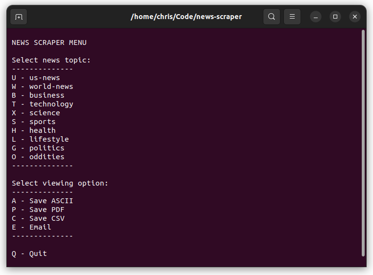
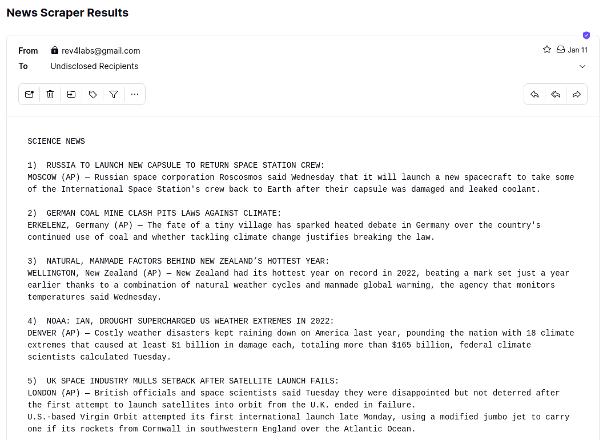
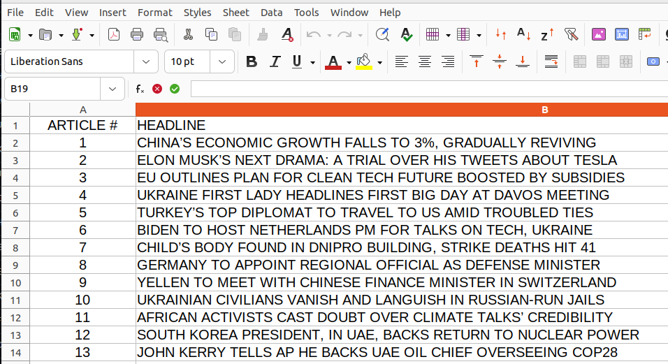

# News Scraper

Scrape news articles from the AP (Associated Press) website. This script allows you to select news topics, view them, save as text files, export to PDF files, export to CSV files, and even email the news articles.

## Features

- Choose from various news topics such as US news, world news, business, technology, science, sports, health, lifestyle, politics, and oddities.
- View news articles directly in the terminal.
- Save news articles as ASCII text files.
- Export news articles to PDF files.
- Export article headlines and numbers to a CSV file.
- Email news articles to a specified email address.

## Screenshots

#### Console Interface



<br>

#### News Headlines by Email



<br>

#### PDF Export


<br>

#### CSV Export



<br>

## Prerequisites & Installation

#### Clone the Repository

First, clone the repository:

```bash
git clone https://github.com/chrisallenarmbruster/news-scraper.git
```

#### Python

Before running the script, make sure you have Python installed. You can download it here:

- [Python 3.x](https://www.python.org/downloads/)

#### Dependencies

You also need to install the following dependencies:

- [Beautiful Soup 4](https://www.crummy.com/software/BeautifulSoup/)
- [Curtsies](https://github.com/thomasballinger/curtsies)
- [pdfkit](https://pypi.org/project/pdfkit/)
- [python-dotenv](https://pypi.org/project/python-dotenv/)

Once you have Python properly installed, you can install these dependencies by running the following command:

```bash
pip install beautifulsoup4 curtsies pdfkit python-dotenv
```

#### Environment Variables

You also need to set up your environment variables for sending emails. You can do this by creating a `.env` file or set the environment variables accordingly. There is an .envSample file for reference. The variables are:

```ini
smtp_server=your_smtp_server
smtp_port=your_smtp_port
user_account=your_email_address
user_password=your_email_password
```

## Usage

To run the program assuming the prerequisites above have been met, simply run the following command form the project's root directory:

```bash
python news_scraper.py
```

Follow the instructions in the terminal to select a news topic and consume the information.

<br>

## Engineers

### [🧑 Chris Armbruster](https://github.com/chrisallenarmbruster)

<br>

## License

Copyright (c) 2023 Rev4Labs

This project is MIT licensed.
